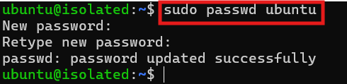
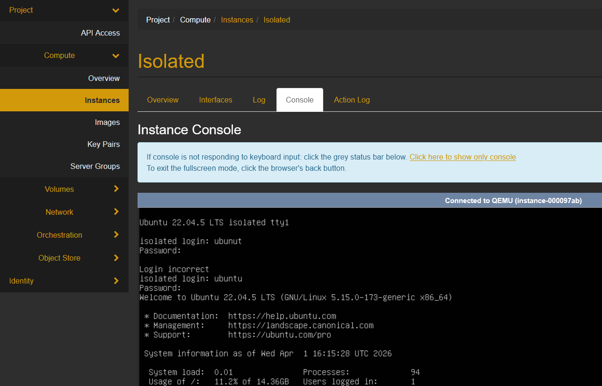
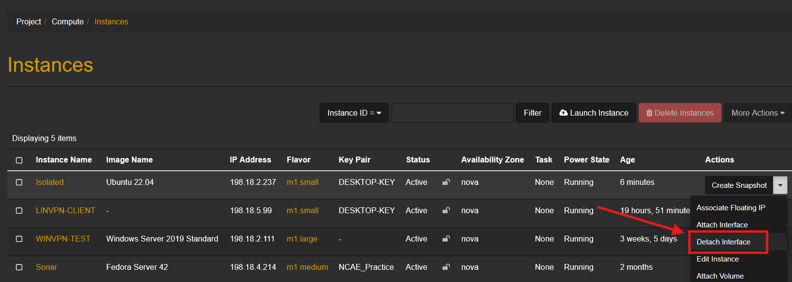
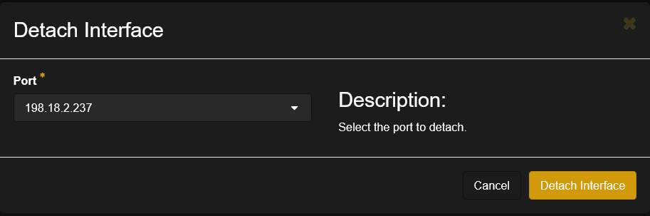
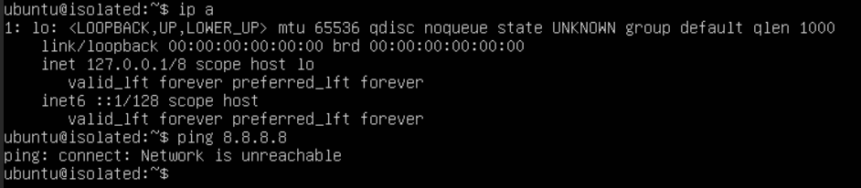
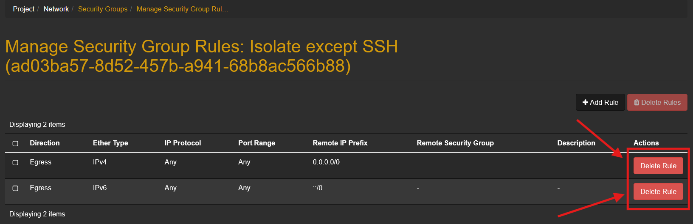
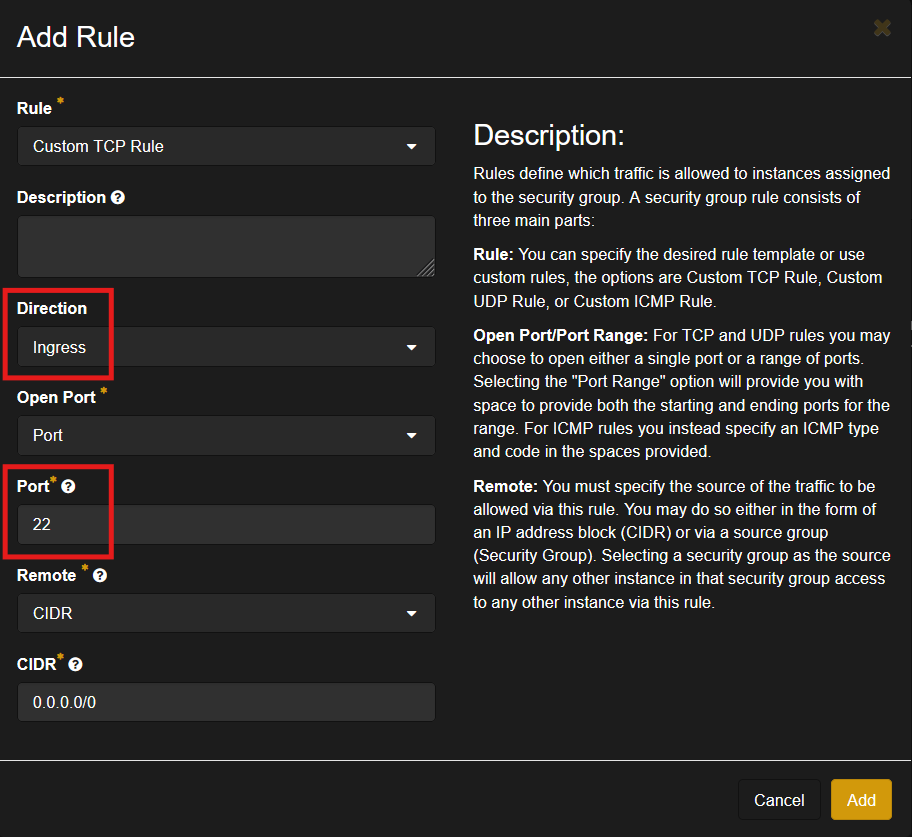
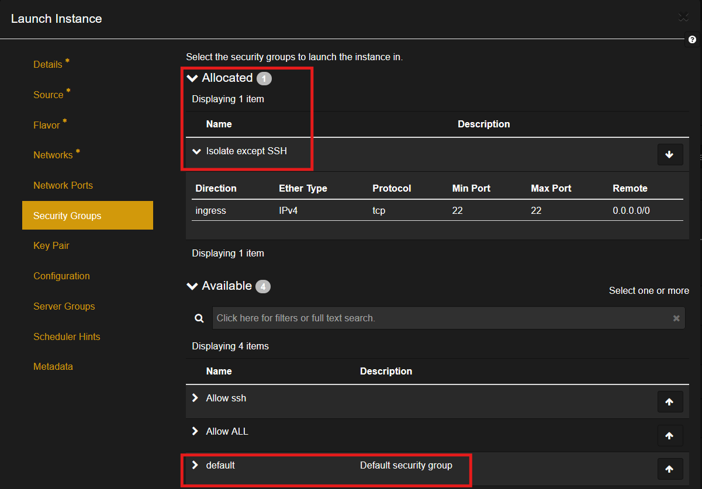
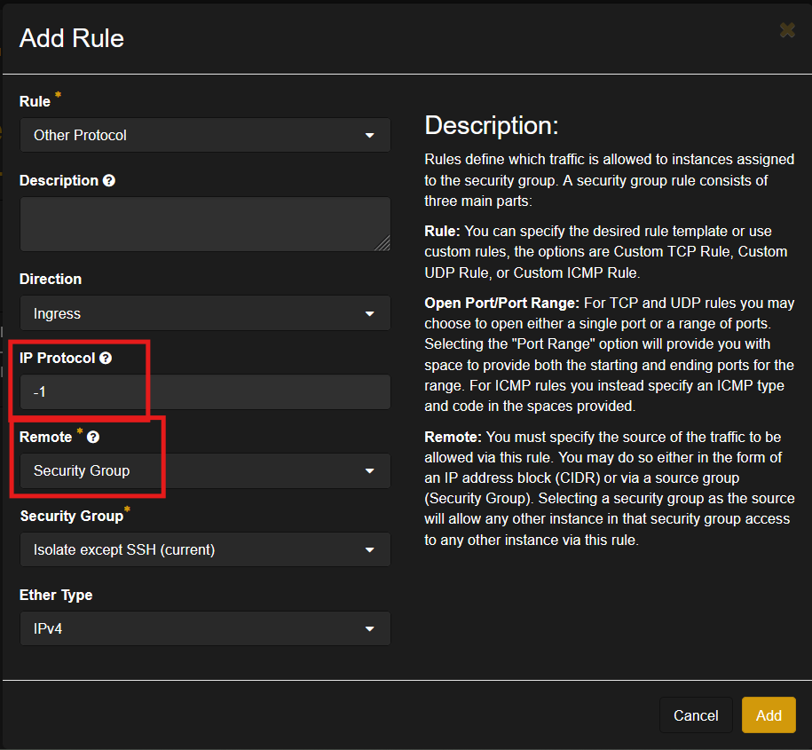

# How to Isolate an Instance from the Network

## Introduction

When testing and analyzing suspicious programs, it is important to cut off network access from the computer running the program. Otherwise, it could spread, commit illegal activity from your computer, or worse. This guide will focus on setting up an isolated instance on OpenStack.

## Prerequisites

Before following this guide, you should know how to

- Set up an instance: [OpenStack Setup Guide](../OpenStack Setup Guide)
- Set up a virtual network and attach an instance: [How to use Virtual Networks](../How to use Virtual Networks)
- Configure security groups: [Security Groups](../Security Groups)

## Option 1: Complete Isolation (Console Access Only)

To be entirely sure the machine is isolated from the internet and other devices, you can detach all network interfaces and only log in through the console on OpenStack. This is inconvenient if you need internet access, but it's the most secure.

1. Create an instance **and attach the external network at first!** 
    - This is necessary because the default user has no password and can't be accessed without an SSH key.
2. Launch the instance and login with SSH using your key
3. Set a password for the default user or create a new user so you can log in through console
    

4. Confirm you can log in through console with your username and password
    

5. After completing all tasks which require internet on the instance, detach the external network from the instance
    
    

6. Confirm that the only interface is loopback and the internet is unreachable
    

!!! note "Reattaching External Network" 
    If you decide to reattach the external network, you may have to manually refresh DHCP or set a static IP. Look up how to refresh DHCP in your OS or see [How to use Virtual Networks](../How to use Virtual Networks) for information on floating IP addresses.

Congrats! You now have an isolated machine that can safely observe malware. But you can only use console, you can't copy paste anything, and you can't upload/download files from the machine. Let's look at a more convenient, but slightly riskier method.

## Option 2: Only Allow Ingress SSH/RDP Connections

Permitting only connections over SSH/RDP to the machine and not from, should be safe. It's very unlikely you would come across malware that can bypass this, but it's not impossible. However, SSH and RDP make interacting with the machines much more convenient, so it's your decision which option to pick.

We will use security groups to block all egress (outbound) and ingress (inbound) traffic **except ingress** SSH or RDP depending on whether you use Linux or Windows.

1. Create a new security group: I'll name it **"Isolate except SSH"**
2. Click **`Manage Rules`** on the new security group and **delete the existing rules**
    

3. Add a new rule to allow ingress SSH (Port 3389 for RDP)
    

4. Create an instance:
    - Attach the external network
    - **Remove the default security group!**
    - Add the security group you just made
    

5. Launch the instance and log in with SSH
6. Confirm that the machine cannot access the internet or other computers

!!! note "Additional Traffic" 
    You can always allow more traffic in the security groups, but keep in mind that the more traffic you allow, the better chance malware has of escaping.

Now your computer is *mostly* isolated from the internet and you can get all the benefits of SSH and RDP!

## Option 3: Isolated Network

Options 1 and 2 are great for running malware or vulnerable programs on a single instance, but what about multiple instances. Perhaps you want to simulate a whole infected network. Let's look at isolating multiple instances in an isolated network.

1. Create a new network: I'll call it **"Isolated"**
2. Follow the same steps for either option 1 or 2, but also
    - Attach the instance to your new network
    - Add a security group to allow all traffic between instances on the isolated network
    

3. Create as many instances as you like on the new network:
    - **Do not attach any of them to the external network**
    - **Add all of them to the security group you made in step 2**

## Conclusion

Now you can safely run suspicious programs on your instance and see what they do. It can be inconvenient being unable to access the internet from your instances, but it's important to take steps to prevent malware from using your machine to partake in illegal activity. **Otherwise, you could be liable.**

!!! note "Final Note"
    There are many other ways of setting up an isolated instance, such as using floating IP addresses, but the basic principle is that **there should be no way for the isolated machine to establish an external connection on its own**. Detaching the network interface or using security groups for ingress traffic only are good ways of accomplishing this.