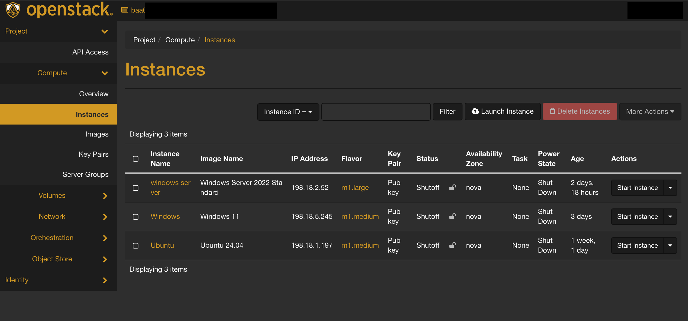
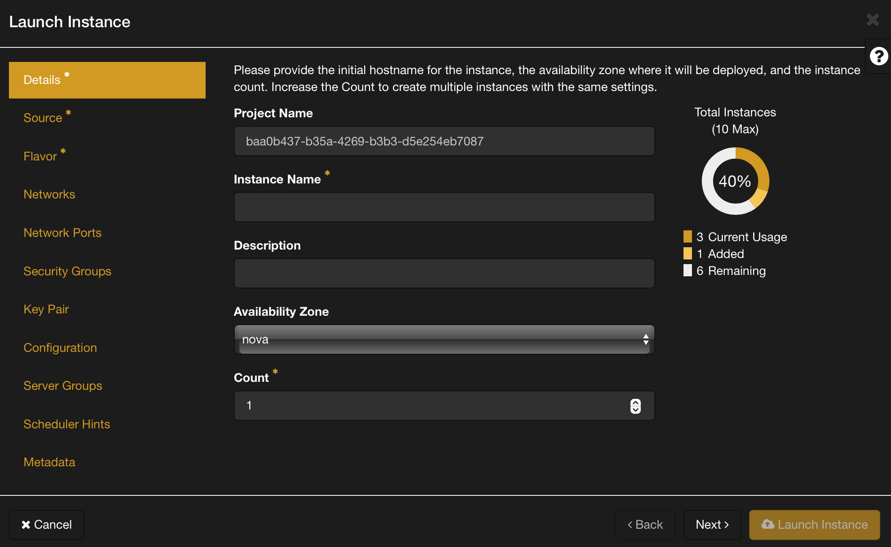

# How to Launch an Instance in OpenStack GUI

Launching an instance in OpenStack GUI is a straightforward process that allows you to deploy virtual machines within your cloud infrastructure. Below is a detailed guide on how to create an instance using the Horizon dashboard.

## Prerequisites

- [Setup Guide](./Openstack Setup Guide.md)
- [Security Groups](./Security Groups.md)

## Step 1: Navigate to the Instance Tab

1. Go to the **Instance** tab in the Horizon dashboard.

## Step 2: Instance Details

1. Click on the **Launch Instance** button.
2. Provide a name for your instance.
3. Optionally, add a description for your instance.

## Step 3: Source

1. Choose the **Image** for your instance. This image serves as the template for your virtual machine.
   - Ensure the selected image meets your requirements and is compatible with your application.

## Step 4: Flavor

1. Select the appropriate **Flavor** for your instance. The flavor determines the size of resources (CPU, RAM, disk space) allocated to your instance.
   - Choose a flavor that aligns with your application's requirements and expected workload.

## Step 5: Network

1. Specify the **Network** to which you want your instance to connect.
   - Choose External Network unless you know what you are doing

## Note: * denotes required fields

- While launching your instance, pay attention to fields marked with a * as they are essential for the instance creation process.

## Optional Configuration

- You have the option to configure additional settings such as security groups, key pairs, and metadata based on your specific requirements. These settings can enhance the functionality and security of your instance.

## Finalizing and Launching the Instance

- Once you have configured the necessary details and optional settings, review your choices to ensure they align with your requirements.
- Click on the **Launch** button to initiate the instance creation process.

## Accessing the Instance Console

- After launching the instance, you can monitor its status in the Horizon dashboard.
- Once the instance is in the "Active" state, click on its name to access its details.
- From the instance details page, click on the **Console** tab to open a console and access your instance remotely.

# Using SSH
Get the ip address of your instance from horizon.
Open up a terminal. For windows I recommend the [new windows terminal](https://aka.ms/terminal). Type ssh then the username for your distro. For example ubuntu is ``ubuntu`` alama is ``alamalinux``. A quick google for ``username cloud image {{distro name}}`` should do the trick. Then type ``ssh {{username}}@{{ip address}}``. Like this ``ssh ubuntu@192.168.20.1``.

## Troubleshooting SSH

Adding ``-v`` will show more details about what is going on. ``ssh -v ubuntu@192.168.20.1``. You can add more ``-vv`` for more details ``ssh -vvv ubuntu@192.168.20.1``.

1. Is your openvpn on?
2. Do you have the right ip adddress?
3. Is your instance connected to the correct network? ``External Network``
4. Is your security groups setup correctly?
5. Is you ssh key added correctly?
6. Is ssh trying to use the correct ssh key?
7. Do you have the correct user name?
8. Ask for help in #infra-helpdesk on discord.

## Conclusion

By following these steps, you can successfully launch an instance in OpenStack GUI, enabling you to deploy virtual machines to meet your computing needs within your cloud environment. Remember to configure your instance with the appropriate settings and resources to optimize its performance and functionality.
