# How to access Windows Instances on Openstack #

There are 2 main ways to get access and control a Windows Instance on Openstack. This tutorial will cover both methods.

## Prerequesites ##

* A newly created Windows Server Instance on Openstack
* Access to Infra via OpenVPN OR On the Cyberlab Secure Network

## Method 1: Using the Openstack Console (Must be used for initial Windows Setup) ##

Openstack has a built-in console viewer for Instances which allows you to get a true console view of the Instance allowing for easier debugging of the Instance. You will have to use this method to initially setup Windows Server.

### Steps: ###
1. On the left plane, choose `Compute` and then `Instances`
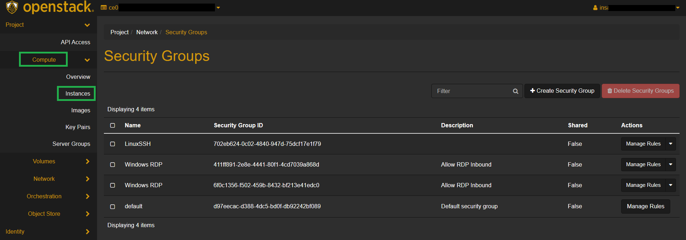
2. Click on the Instance to view
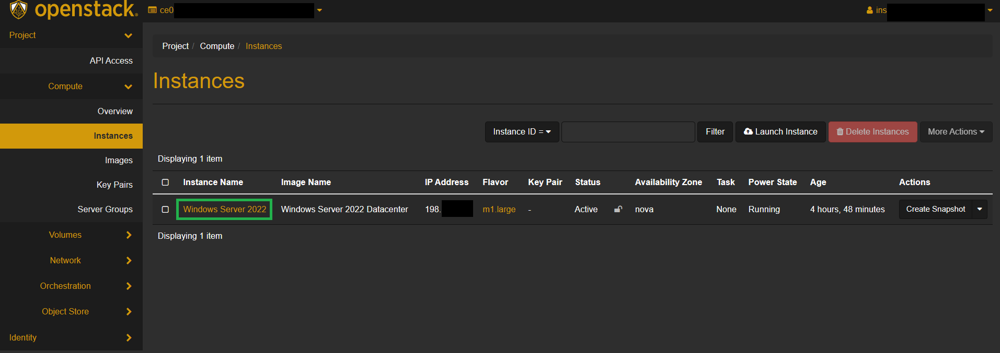
3. Click on the `Console` tab
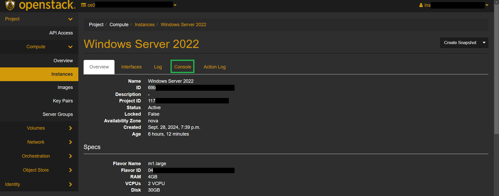
4. You now have a console view of the Instance! From here you can add an Administrator password to Windows and use the Instance!
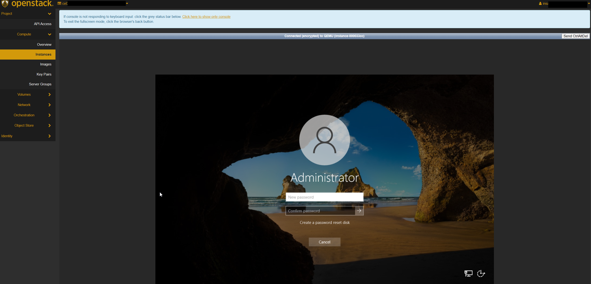

## Method 2: Using Remote Desktop Connection ##

Remote Desktop Connection (Also known as RDP somtimes) is a program in Microsoft Windows that allows you to access another Windows computer over a network. Using this method has added benefits such as easy folder sharing, viewing the Instance in full-screen mode, clipboard sharing and more!

By default, Openstack blocks all inbound connections to Instances and therefore we need to make a security group to allow inbound RDP access

Important Note: You cannot directly use this method on the very first time you startup your Instance as Windows requires you to set an Administrator password upon Instance creation. Follow Method 1 to gain initial access to the machine and add a password.

### Step 1: Creating a security group ###
1. Connect to Infra via OpenVPN or `Cyberlab Secure`
2. Go to `horizon.hackucf.cloud` and log into your account
3. Click on `Network` on the left-hand pane and then `Security Groups`
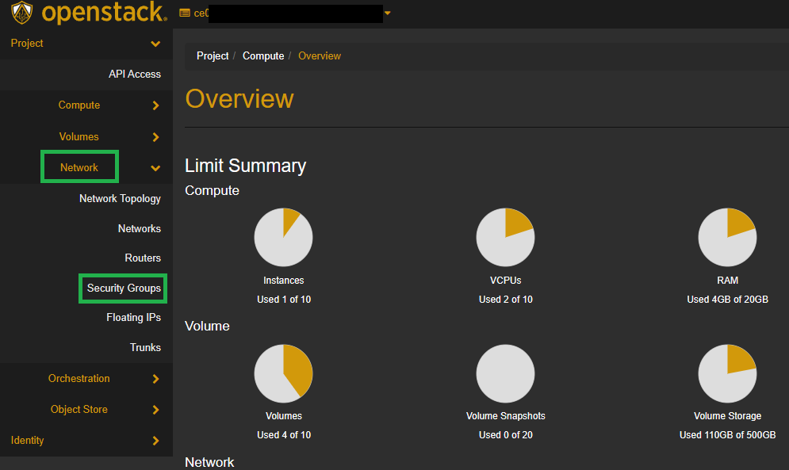
4. On the right-hand side, click on `Create Security Group` and give it a name and description, then press `Create Security Group`
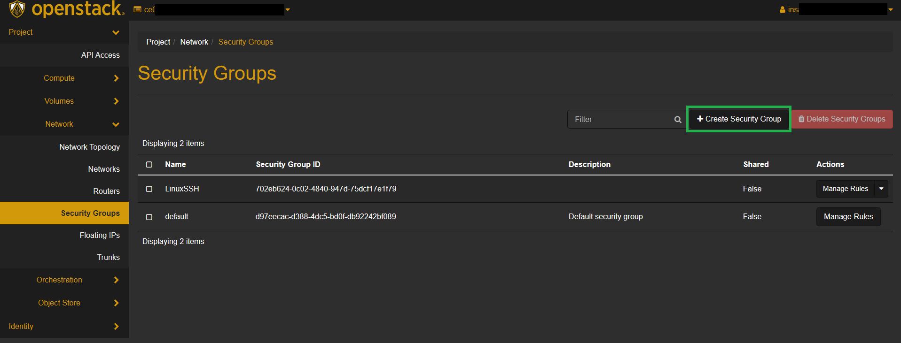

5. On the Manage Security Group Rules screen, click `Add rule`
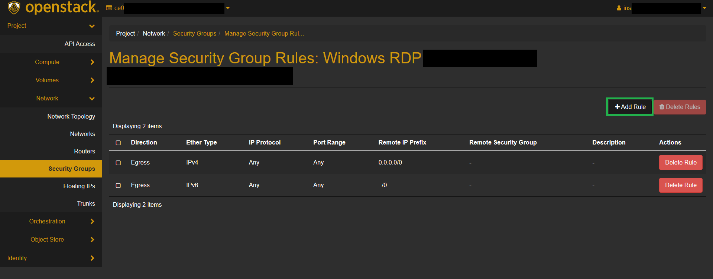
6. Choose the `RDP` Rule in the Rule dropdown, leave all other options as default and click `Add`
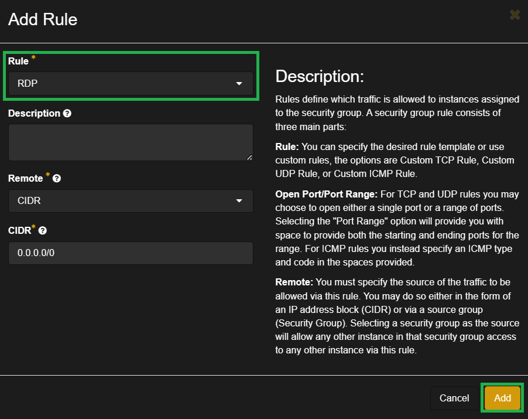

This new group can be applied to any future Windows Instances to quickly allow RDP access

### Step 2: Adding the security group to your Instance ###
1. On the left plane, choose `Compute` and then `Instances`

2. Click on the Instance to add the security group to

3. Click the dropdown arrow on the right and select `Edit Security Groups`
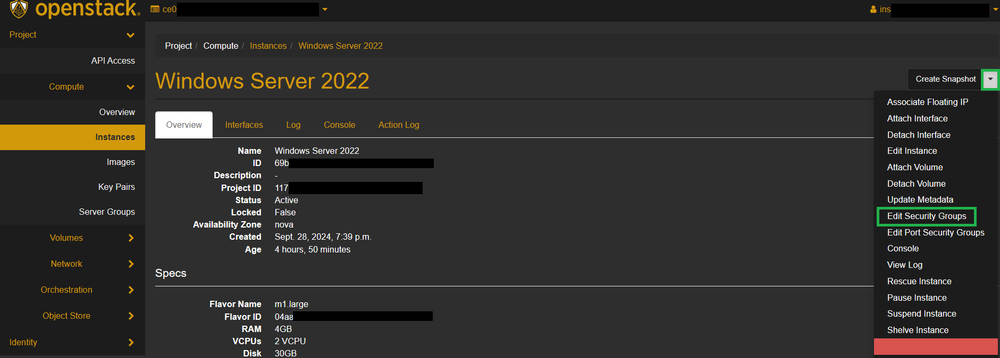

4. Select the appropriate security group and select `Save`

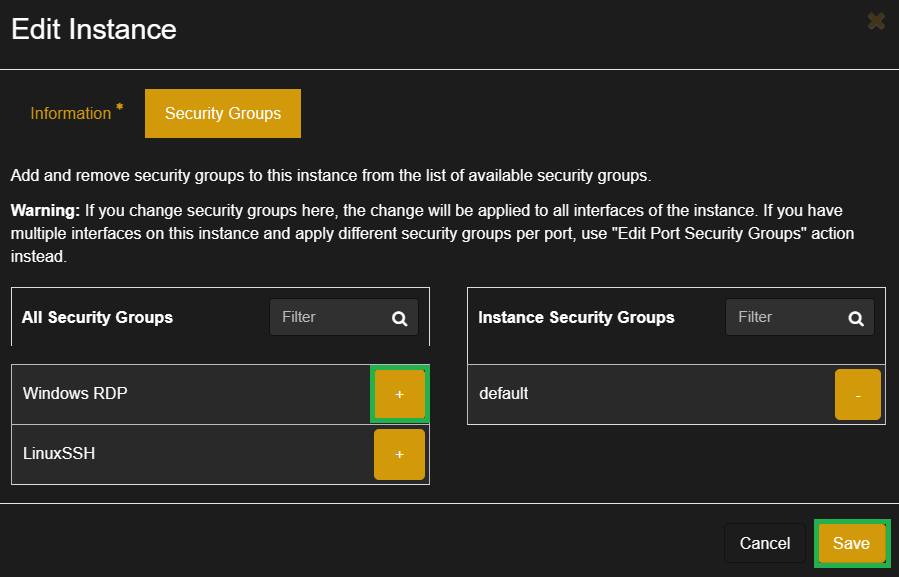

RDP will now be allowed through the Openstack firewall for the instance!

### Step 3: Connecting to the instance ###
1. Open your remote desktop client
    * Windows Clients: Open Start Menu > type in "Remote Desktop Connection"
    * MacOS Clients: [Windows App](https://apps.apple.com/us/app/microsoft-remote-desktop/id1295203466?mt=12)
    * Linux Clients: [Remmina](https://remmina.org/)
2. Enter the IP address of your Instance and press `Connect` (You can find this in Compute > Instances)

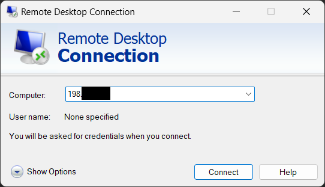

3. Enter the credentials for the Instance and select OK

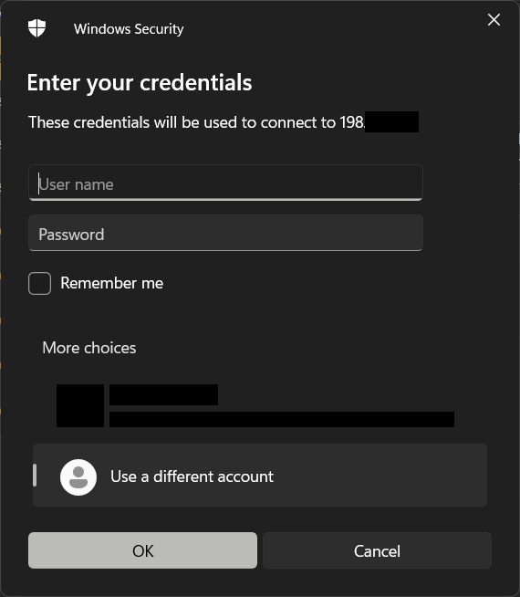

4. You will be successfully connected to the Instance!

## Retrieving Windows Password #

To retrieve the Windows password for an instance in OpenStack Horizon, you need to follow these steps. This process assumes that you have created the instance with an SSH key, which is necessary for decrypting the password.

### Step 1: Creating an Instance with an SSH Key ##

1. On the left pane, choose `Compute` and then `Instances`.
2. Click on `Launch Instance`.
3. Fill in the necessary details for your instance, such as the instance name and flavor.
4. Under the `Key Pair` section, select an existing key pair or create a new one. This key pair will be used to decrypt the Windows password. **Ensure the key is a RSA key.**
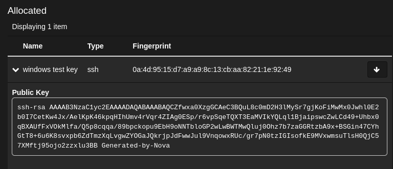

### Step 2: Retrieving the Windows Password ##

1. On the left pane, choose `Compute` and then `Instances`.

2. Click on the instance for which you want to retrieve the password.

3. Click on the `Actions` dropdown menu on the right and select `Retrieve Password`.

4. In the `Retrieve Password` dialog, click on `Choose File` and upload the private key file associated with the SSH key pair used during instance creation.
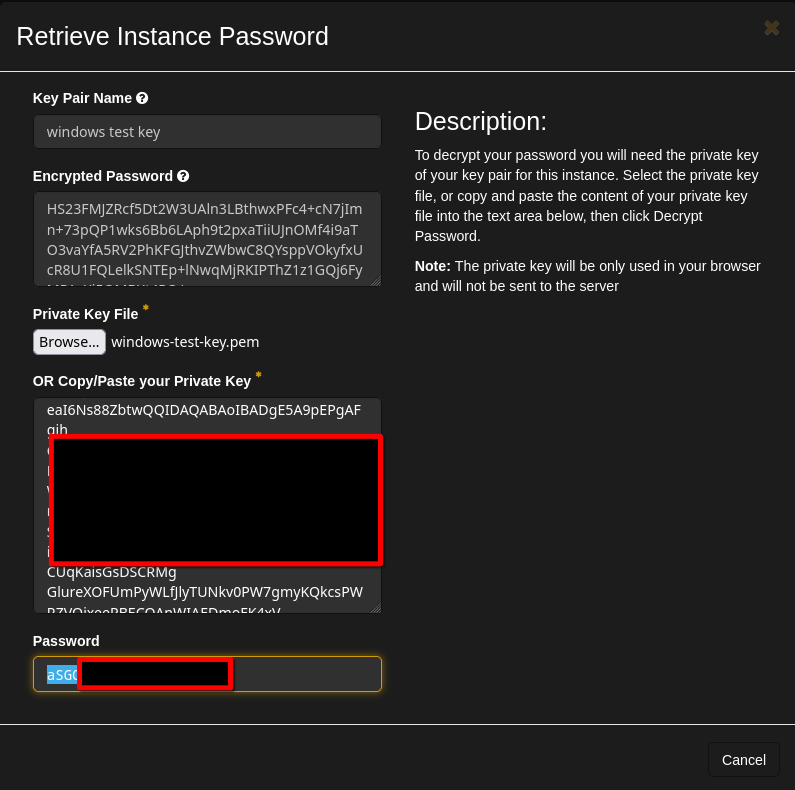
5. Click on `Decrypt Password`. The decrypted password will be displayed.

You can now use this password to log in to your Windows instance via the OpenStack console or Remote Desktop Connection.
