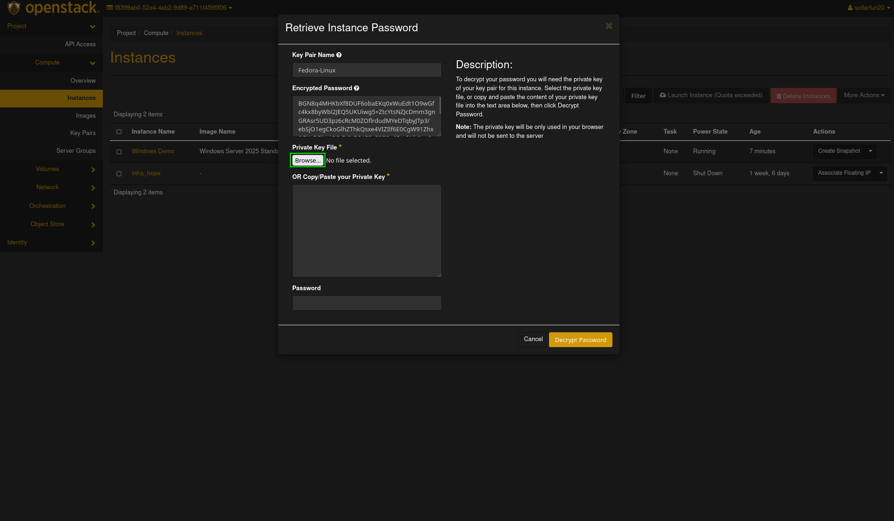
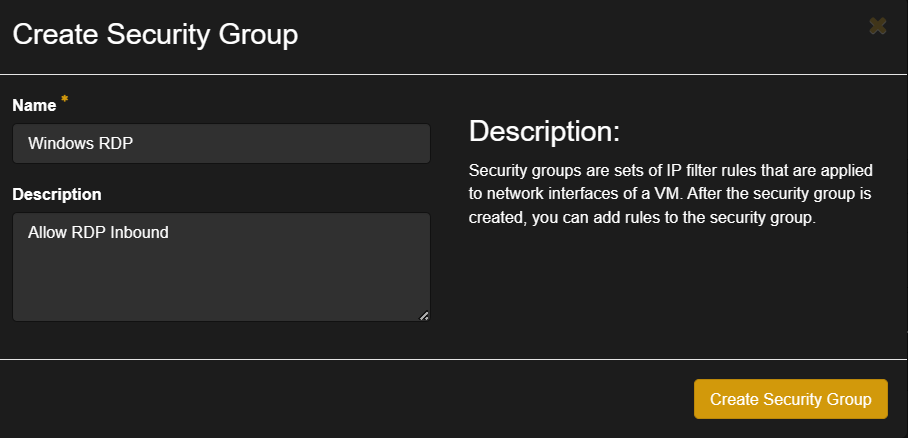
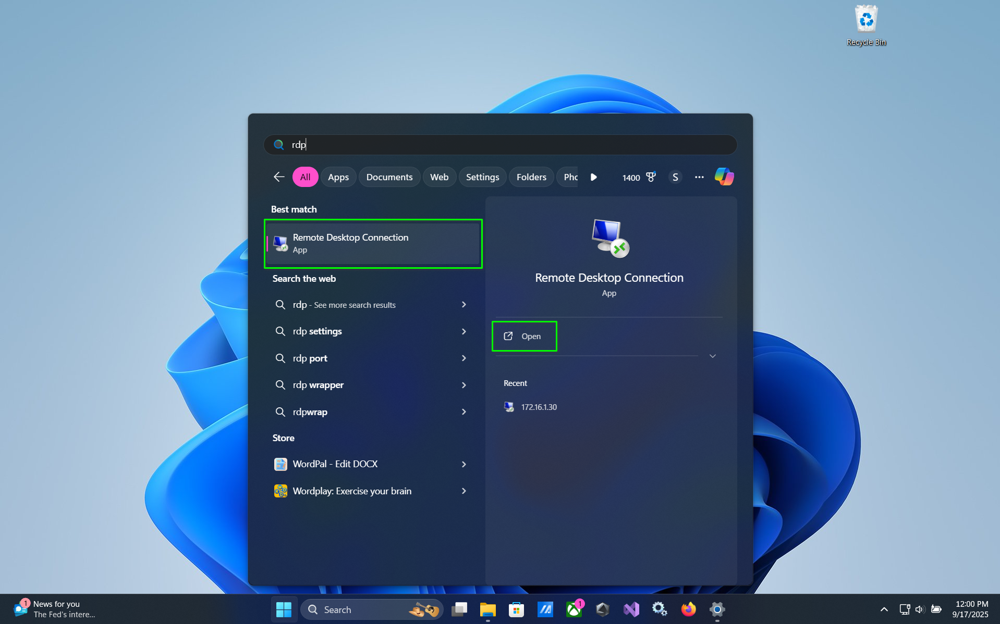
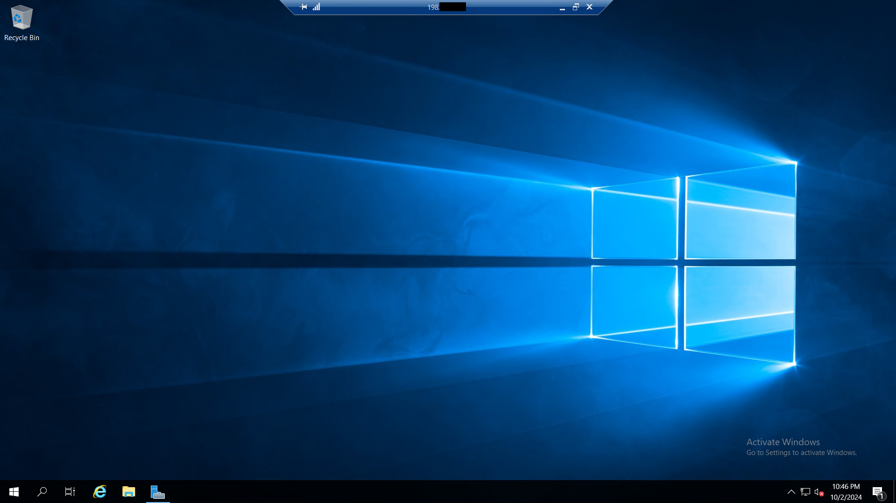
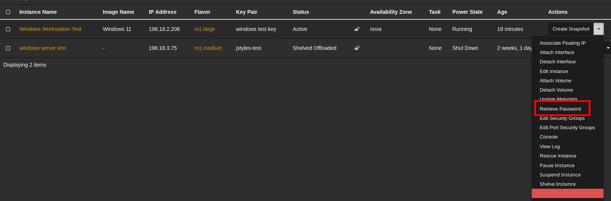

# How to access Windows Instances on Openstack #

There are 2 main ways to get access and control a Windows Instance on Openstack. This tutorial will cover both methods.

## Prerequesites ##

* A newly created Windows Server Instance on Openstack
* Access to Infra via OpenVPN OR On the Cyberlab Secure Network

## Preparation: Recover your Windows Instance Password ##
For some windows instance images, you will need to retrieve the password so you can set a new administrator password. If you already have an instance created and going with an SSH key, you can skip Step 1.  

- Step 1: Create instance with an SSH key (use images from repo)
    1. On the left pane, choose `Compute` and then `Instances`. 
    
    2. Locate the instance you want to access the console of, and click on its name.
    
    3. Select the `Console` tab under the instance name. 
    
    4. Send a ctrl+alt+delete to the server by pressing the `Send CtrlAltDelete` button in the upper right hand corner. 
    
    5. Log into the instance. If this is your first time, it may ask you to change the password. If it asks you for the pervious password, enter the password you retrieved earlier, then enter in the password you would like, make sure to note it down.
    

## Method 1: Connect Using the Openstack Console (Must be used for initial Windows Setup) ##

Openstack has a built-in console viewer for Instances which allows you to get a true console view of the Instance allowing for easier debugging of the Instance. You will have to log in using this method to initially set up any new Windows Instance. 

### Steps: ###
1. On the left plane, choose `Compute` and then `Instances`.

2. Locate the instance you want to access the console of, and click on its name.

3. Select the `Console` tab under the instance name.

4.  Send a ctrl+alt+delete to the server by pressing the `Send CtrlAltDelete` button in the upper right hand corner.

5. Log into the instance. If this is your first time, it may ask you to change the password. If it asks you for the pervious password, enter the password you retrieved earlier, then enter in the password you would like, make sure to note it down.

6. You may now access the instance through the openstack console normally as you would any other windows device.

## Method 2: Using Remote Desktop Connection (RDP)##

Remote Desktop Connection (Also known as RDP somtimes) is a program in Microsoft Windows that allows you to access another Windows computer over a network. Using this method has added benefits such as easy folder sharing, viewing the Instance in full-screen mode, clipboard sharing and more!

By default, Openstack blocks all inbound connections to Instances and therefore we need to make a security group to allow inbound RDP access

Important Note: You cannot directly use this method on the very first time you startup your Instance as Windows requires you to set an Administrator password upon Instance creation. Follow Method 1 to gain initial access to the machine and add a password.

### Part 1: Opening RDP Access for your Instance ###

#### Step 1: Creating a security group ###
1. Connect to Infra via OpenVPN or `Cyberlab Secure`
2. Go to `horizon.hackucf.cloud` and log into your account
3. Click on `Network` on the left-hand pane and then `Security Groups`

4. On the right-hand side, click on `Create Security Group` and give it a name and description, then press `Create Security Group`

5. On the Manage Security Group Rules screen, click `Add rule`

6. Choose the `RDP` Rule in the Rule dropdown, leave all other options as default and click `Add`

This new group can be applied to any future Windows Instances to quickly allow RDP access

#### Step 2: Adding the security group to your Instance ###
1. On the left plane, choose `Compute` and then `Instances`

2. Click on the Instance to add the security group to

3. Click the dropdown arrow on the right and select `Edit Security Groups`

4. Select the appropriate security group and select `Save`

RDP will now be allowed through the Openstack firewall for the instance!

### Part 3: Connecting to your the instance ###

#### Connecting from Another Windows Device ####
This is the most simple way to access a windows instance with RDP, as Windows comes with the needed software pre-installed. 
**Make sure you are connected to the HACK@UCF infrastructure via OpenVPN before attempting to connect**

1. On the left plane, choose `Compute` and then `Instances`

2. Locate the name of the instance you want to access and note down it IP address.

3. Open the Windows Start Menu, type in "Remote Desktop Connection", and open the `Remote Desktop Connection` application

4. In the `Computer:` field, enter in the IP address of you noted in step 2, and press `Connect`.

5. When windows security prompts you to enter your credentials, select `Use a different account`.

6. In the `User name` field, enter "Administrator", and in the `Password` field, enter in the password you set when first logging in to your Windows instance, then select `OK`.

7. If you recieve a warning from windows stating that "The identity of the remote computer cannot be verified", check the `Don't ask me again for connections to this computer` option, and then select `Yes`.

8. You are now logged into your instsance, and you can navigate as you would any windows device.

#### Connecting to your Windows instance from a Linux Device ####
For connecting to a windows instance with RDP for Linux, we will use the Remmina client.
See https://remmina.org/how-to-install-remmina/ for more help with installing the Remmina client.

1. Open Remmina, either from your applications menu or the console. 
2. Press the `+` add new connection button in the top left corner.

3. In the `Name` field, enter in what you would like to name the connection to your windows instance.

4. Select the `Protocol` dropdown and select `RDP - Remote Desktop Protocol` as your protocol.

5. In the`Server` field, enter in your instance's IP address.

6. In the `Username` and `Password` fields, enter in the username (likely "Administrator") and password you set on the instance earlier.

7. Select `Save and Connect`.

8. When prompted to accept the server's certificate, select `Yes`.

9. Verify the authentication credentials, then select `OK`.

10. You should now be logged in to the windows instance and be able to navigate as you would any windows device.

### Step 3: Connecting to the instance ###
1. Open your remote desktop client
    * Windows Clients: Open Start Menu > type in "Remote Desktop Connection"
    * MacOS Clients: [Windows App](https://apps.apple.com/us/app/microsoft-remote-desktop/id1295203466?mt=12)
    * Linux Clients: [Remmina](https://remmina.org/)
2. Enter the IP address of your Instance and press `Connect` (You can find this in Compute > Instances)

3. Enter the credentials for the Instance and select OK

4. You will be successfully connected to the Instance!

## Retrieving Windows Password #

To retrieve the Windows password for an instance in OpenStack Horizon, you need to follow these steps. This process assumes that you have created the instance with an SSH key, which is necessary for decrypting the password.

### Step 1: Creating an Instance with an SSH Key ##

1. On the left pane, choose `Compute` and then `Instances`.
2. Click on `Launch Instance`.
3. Fill in the necessary details for your instance, such as the instance name and flavor.
4. Under the `Key Pair` section, select an existing key pair or create a new one. This key pair will be used to decrypt the Windows password. **Ensure the key is a RSA key.**

### Step 2: Retrieving the Windows Password ##

1. On the left pane, choose `Compute` and then `Instances`.

2. Click on the instance for which you want to retrieve the password.

3. Click on the `Actions` dropdown menu on the right and select `Retrieve Password`.

4. In the `Retrieve Password` dialog, click on `Choose File` and upload the private key file associated with the SSH key pair used during instance creation.

5. Click on `Decrypt Password`. The decrypted password will be displayed.

You can now use this password to log in to your Windows instance via the OpenStack console or Remote Desktop Connection.
