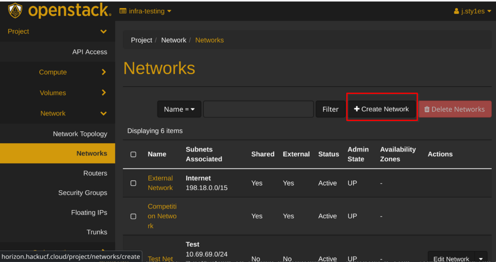
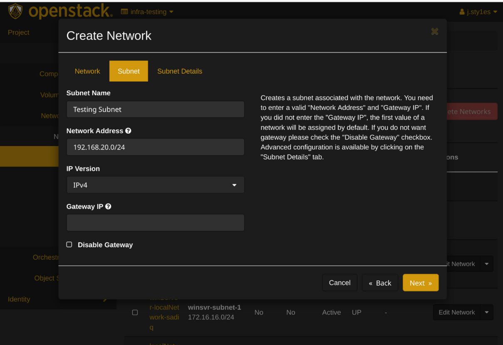
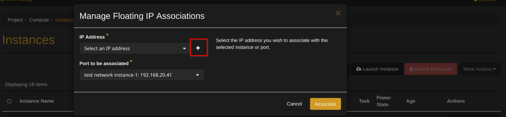

# How to use Virtual Networks

## Introduction

Virtual Networks are software-defined networks that simulate physical networking equipment and connections in a cloud environment. In OpenStack, they allow you to create isolated network environments where you can deploy and connect virtual machines without physical hardware.

Virtual Networks are essential tools in OpenStack cloud environments for cyber learning and security training. They provide several key benefits:

**Network Isolation & Security**: Virtual Networks create secure, isolated network segments that allow students to experiment with different network configurations without affecting other users or the broader infrastructure. This is crucial for cybersecurity labs where you might be testing attack vectors or vulnerability assessments.

**Realistic Training Scenarios**: In cyber learning, you often need to simulate real-world network topologies including DMZs (Demilitarized Zones - network segments that expose external-facing services), internal networks, and external connections. Virtual Networks enable you to create these complex, multi-tier network architectures within your OpenStack environment.

**Safe Testing Environment**: When learning penetration testing, malware analysis, or incident response, Virtual Networks provide a contained environment where potentially dangerous activities can be performed safely without risk to production systems.

### What You'll Learn
In this guide, you'll learn how to:
- Create your own virtual network
- Set up a router to connect networks
- Launch instances (virtual machines) in your network
- Configure floating IPs for external access


## Prerequisites

Be sure to follow the instructions in the [OpenStack Setup Guide](../OpenStack Setup Guide) before proceeding with this guide.

## Creating a Virtual Network

1. **Log in** to your OpenStack dashboard
2. Navigate to **`Project > Network > Networks`**
    - {width="50%",loading=lazy}

3. Click **`Create Network`**
    - {width="50%",loading=lazy}

4. In the "Network" tab:
    - Enter a **name** for your network (e.g., "internal-network")
    - Click **`Next`**
    - {width="50%",loading=lazy}
5. In the "Subnet" tab:
    - Enter a **subnet name** (e.g., "internal-subnet")
    - Enter **Network Address** (e.g., "192.168.1.0/24")
    - Click **`Next`**
    - {width="50%",loading=lazy}
6. In the "Subnet Details" tab:
    - Defaults are fine; Click **`Create`**


## Creating a Router

!!! note "What is a Router?"
    In virtual networking, a **router** connects different networks together, just like a physical router. It:
    - Allows traffic to flow between your internal network and external networks
    - Performs Network Address Translation (NAT) between private and public IP addresses
    - Enables your instances to access the internet and be accessed from outside
    - Acts as a gateway for your subnet


1. Navigate to **`Project > Network > Routers`**
2. Click **`Create Router`**
3. Enter a **name** for your router (e.g., "main-router")
4. Select **"External Network"** as the External Network
    - {width="50%",loading=lazy}
5. Click **`Create Router`**
6. Click on your new router
7. Go to the **"Interfaces"** tab
8. Click **`Add Interface`**
9. Select your **internal network subnet**
    - {width="50%",loading=lazy}
10. Click **`Submit`**

## Creating Instances

!!! note "What is an Instance?"
    An **instance** is a virtual machine running in the cloud. In OpenStack:
    - Instances are created from images (templates containing an operating system)
    - They run on the physical hardware of the cloud but are isolated from other users
    - You can create multiple instances with different configurations
    - Instances in your virtual network can communicate with each other

1. Follow the instruction in [How to Launch an Instance](../guides/How%20to%20Launch%20an%20Instance.md)
2. When configuring networking, **select your internal network subnet** instead of the external network
      - {width="50%",loading=lazy}


## Adding a Floating IP

!!! note "What is a floating Ip?"

    In OpenStack, a Floating IP is a public, routable IP address that can be dynamically assigned to instances. Think of it like a mobile phone number that you can assign to different phones:
    ## How it works
    1. Each instance gets a **fixed IP** (e.g., 192.168.1.10) on the internal network
    2. A **Floating IP** (e.g., 203.0.113.10) can be assigned to make the instance accessible from the internet
    3. The router performs NAT (Network Address Translation) between the floating and fixed IPs
    4. When you reassign a floating IP, external access moves to the new instance while fixed IPs remain unchanged

1. Navigate to **`Project > Compute > Instances`**
2. Click the **dropdown menu** next to your first instance
    - {width="50%",loading=lazy}
3. Select **`Associate Floating IP`**
4. Click the **`+` button** to allocate a new floating IP
    - {width="50%",loading=lazy}
5. Select **"external-network"** from the pool
6. Click **`Allocate IP`**
7. Select the new IP address
8. Click **`Associate`**


# More Info

## Accessing Your Instance

1. Ensure you have your **private key** ready
2. Open your **terminal**
3. Use **SSH** to connect:
   ```
   ssh -i /path/to/your/key.pem ubuntu@<floating-ip>
   ```
   Replace `ubuntu` with the appropriate username for your chosen image

## Security Groups

!!! note "What are Security Groups?"
    **Security Groups** function as virtual firewalls for your instances:
    - They control which inbound and outbound traffic is allowed
    - By default, all incoming traffic is blocked
    - You must explicitly allow traffic for services you want to access (like SSH)
    - They provide an essential layer of security for your virtual machines

Remember to configure your security groups to allow SSH (port 22) and any other required ports:

1. Navigate to **`Project > Network > Security Groups`**
2. Click **`Manage Rules`** on the default security group
3. Click **`Add Rule`**
4. Select **"SSH"** from the rule dropdown
5. Click **`Add`**

## Troubleshooting Common Issues

If you encounter problems with your virtual network setup:

- **Can't connect to instance**: Check that your security group **allows SSH traffic**
- **No internet access from instance**: Ensure your router is **properly connected** to both networks
- **Floating IP not working**: Verify the floating IP is **correctly associated** with your instance
- **Network connectivity issues**: Check that your subnet CIDR **doesn't conflict** with other networks


## Next Steps

After setting up your virtual network, consider:
- Creating multiple networks for different purposes (development, testing, etc.)
- Setting up network security rules between subnets
- Configuring load balancers for distributed applications
- Exploring software-defined networking capabilities in OpenStack

## Glossary

- **DMZ**: Demilitarized Zone - A network segment that exposes external-facing services while protecting the internal network
- **Floating IP**: A public IP address that can be dynamically assigned to instances
- **Instance**: A virtual machine running in the cloud
- **NAT**: Network Address Translation - Maps private IP addresses to public ones
- **Router**: A virtual device that connects different networks together
- **Security Group**: A set of firewall rules that control traffic to/from instances
- **Subnet**: A logical subdivision of an IP network, defined by a CIDR range
