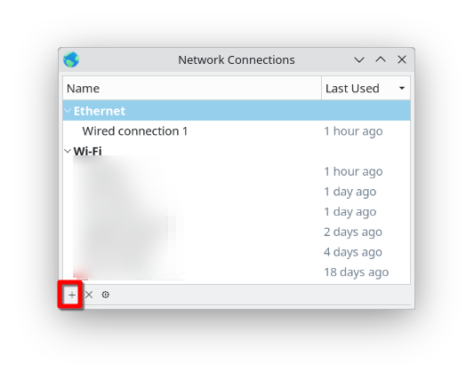
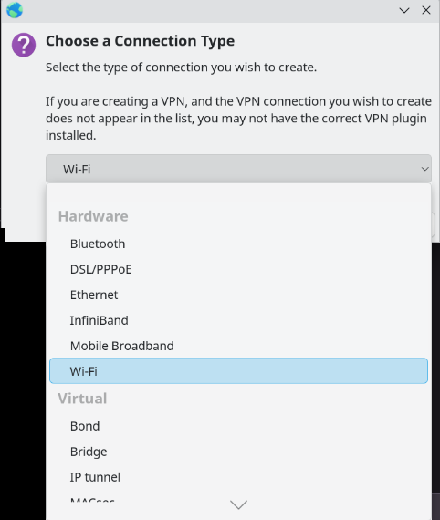
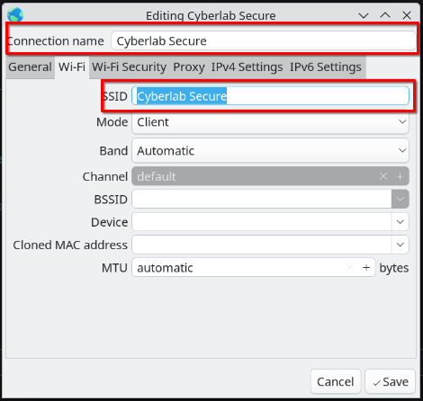
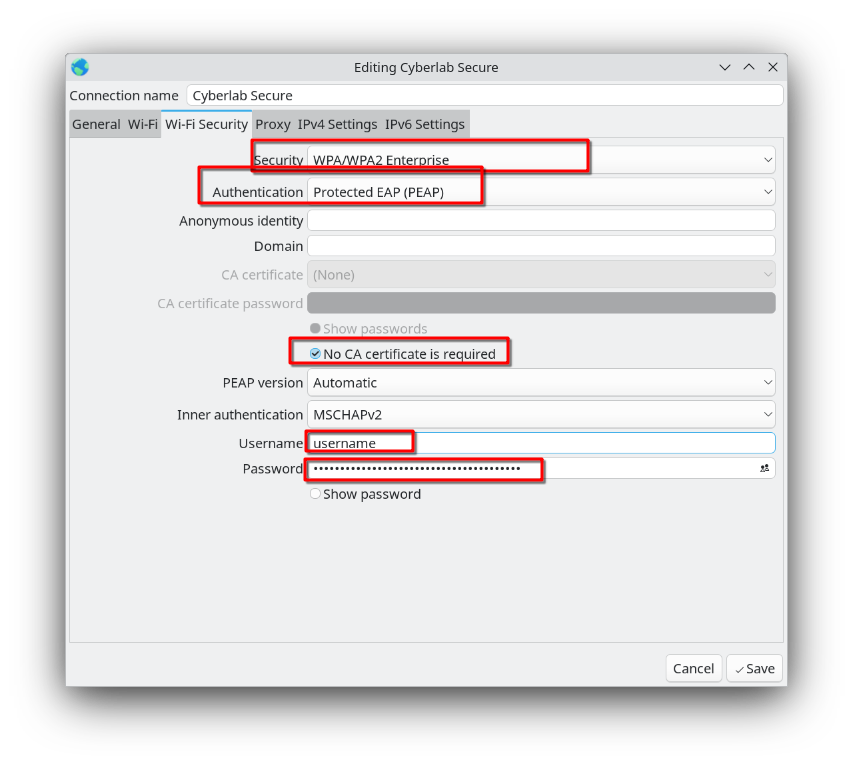

# How to use Cyberlab Secure on Linux

1. Install nm-connection-editor
      - **Ubuntu**
      ```
      sudo apt update &&
      sudo apt install network-manager-gnome
      ```

      - **Fedora**
      ```
      sudo dnf install nm-connection-editor
      ```

      - **Arch**
      ```
      sudo pacman -S network-manager-applet
      ```


??? note "Note about compatibility"

    This should work on most distributions that use NetworkManager and wpa_supplicant. If you are using a different network manager, you may need to use a different tool to connect to Cyberlab Secure.
    Other distros are officially unsupported, but you can try to use the nm-connection-editor tool to connect to Cyberlab Secure.


2. Run nm-connection-editor
```bash
sudo nm-connection-editor
```

3. Click on the + button to add a new connection
    - 

4. Select Wifi and click Create
    - 

5. In the wifi tab fill in the following:
    * Connection Name: `Cyberlab Secure`
    * SSID: `Cyberlab Secure`
    * Mode: `Client`
    * Band: `Automatic`
    * Device: `leave blank`
    * MAC Address: `leave blank`
    * Cloned MAC Address: `leave blank`
    * MTU: `Automatic`
    * Available to all users: `checked`
    * All other fields can be left as default
    * 

6. In the wifi security tab fill in the following:
      * Security: `WPA & WPA2 Enterprise`
      * Authentication: `Protected EAP (PEAP)`
      * Anonymous Identity: `leave blank`
      * Domain: `leave blank`
      * CA Certificate: `leave blank`
      * Check box for No CA certificate is required
      * PEAP Version: `Automatic`
      * Inner Authentication: `MSCHAPv
      * Username: `Your SSO Username`
      * Password: `Your SSO Password`
      * 

7. Select Save

8. Connect to the network
The Cyberlab Secure network should be available where you normally connect to Wi-Fi. If not, run
```bash
nmcli connection up "Cyberlab Secure"
```


### Troubleshooting

If you are having trouble connecting to the network, try the following steps:

1. Run ``sudo journaclctl -u NetworkManager`` to see if there are any errors

2. Run ``sudo journalctl -u wpa_supplicant`` to see if there are any errors

3. Create ticket in infra help desk
