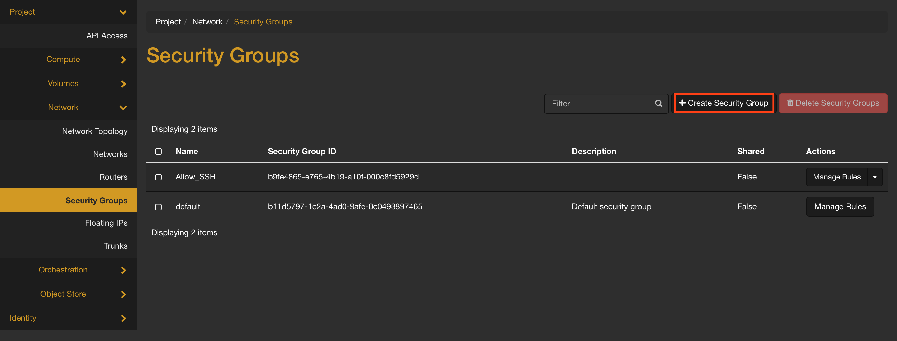
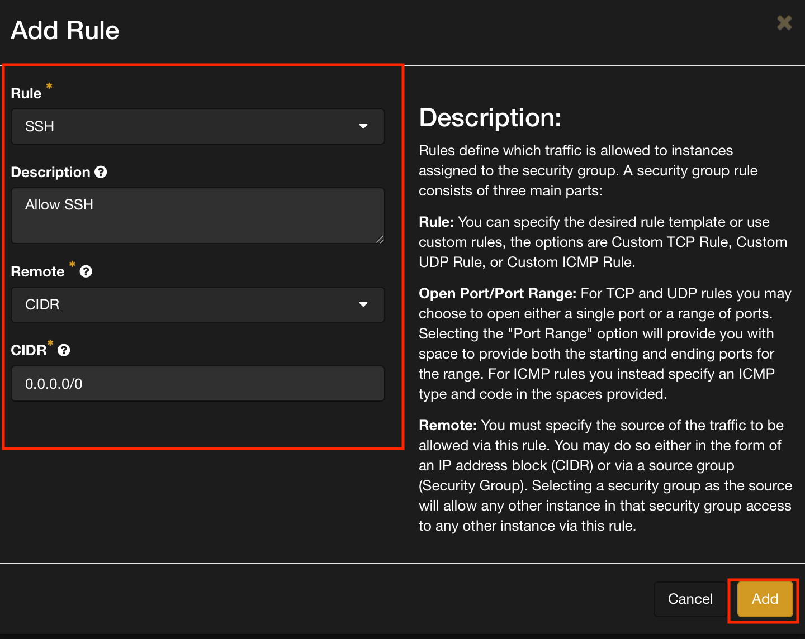

# Securtiy Groups Guide

This guide provides a step by step walkthrough of how to get started utilizing security groups in OpenStacks


# What are Security Groups?

Security Groups are what allows you to determine what inbound and outbound traffic is allowed into your instances (virtual machines).
In simple terms they act like a virtual firewall that operates at the instance level, controlling access based on IP addressess, port numbers, and protocols.


# OpenStacks Default Security Group Settings

When creating an instance on OpenStack if you don't implement your own security group it will use its default.
The default rules set the following standard:

```
Inbound Traffic: Blocked by default
Outbound Traffic: Allowed by default
```
Depending on your security and accessibility needs you'll need to tailor your secuity groups accordingly.


# Example- Allowing SSH via Security Groups

1. Once you have logined into your openstack portal navigate to the Networks tab and click Security Groups located in the column on the left hand side of the screen 

2. Click on Create Security Group


3. Name your new Secuirty Group something like "Allow SSH" or something similar to make it easier to remember in the future. You can also add a description for further clarification. When you're finished naming click Create Security Group.


4. You'll then be taken to the rule management papge. Here you can add the specific rules you want for traffic on your instance. Here's a break down of the terms you'll see:

    - Egress: Outgoing network traffic from your vm
    - Ingress: Inbound network traffic to your vm
    - Ether Type: Identifies the protocal type of the payload (Typically IPv4 or IPv6)
    - IP Protocol: Specifies which network protocol the rule applies to (TCP, UDP, ICMP)
    - Port Range: Specifies which ports the rule applies to
        - Port 22: Typically used for SSH traffic
        - Port 80: Typically used for HTTP web traffic
    - Remote IP Prefix: Defines the source or destination IP addresses in CIDR notation
    - Remote Security Group: Specifies another security group as the source or destination

5. Click on Add Rule


6. Update the following drop down boxes to all SSH and click add to create the new rule


7. (Optional) If you'd like to be able to ping your instance to check if it's working for inbound ssh traffic you can add another rule to allow ICMP (Internet Control Message Protocol)


# Summary
Now you should be all set to create and add your own Security Groups to your instances. Good luck on your Infra journey!

[//]: # ()


# Next Steps 

- Go to [How to Launch an Instance](./How to Launch an Instance.md)
